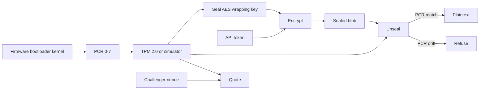

# Rivet

A small host attestation agent. Rivet reads TPM 2.0 PCRs 0–7 (BIOS, bootloader,
kernel), seals a wrapping key to that baseline, and refuses to unseal if the
boot state drifted. Secrets such as API tokens stay ciphertext until the TPM
policy matches.

Rivet currently runs only against an in-process simulator that keeps the same
PCR-binding rule. It does not talk to `/dev/tpmrm0` yet; a real TPM 2.0 backend
(for example via tpm2-tss) is the main missing piece, and sealed blobs from the
simulator are not hardware-protected.

```bash
pip install -e ".[dev]"
echo 'api-token' | rivet seal api
rivet unseal api
make test
```

## Data flow



Trust boundary is the TPM (or the simulator process in tests). The daemon only
listens on a Unix socket.

## Commands

- `rivet detect` — `hardware` or `simulator`
- `rivet pcr` — dump PCR 0–7
- `rivet baseline` — store the current digest
- `rivet seal NAME` — encrypt stdin to the live PCR policy
- `rivet unseal NAME` — decrypt only if PCRs still match
- `rivet quote --nonce HEX` / `rivet verify QUOTE --nonce HEX`
- `rivet daemon --socket /tmp/rivet.sock`

## License

MIT. See [LICENSE](LICENSE).
